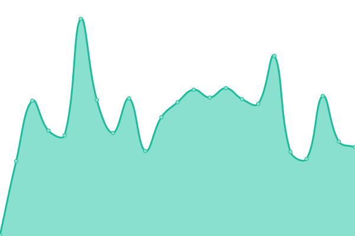

# 📡 Happening Now — Platform Status

👉 **View recent announcements:** 📣 [Announcements](https://github.com/ReyWins/happeningnow-status/discussions/categories/announcements)

## <!--live status--> **🟩 All systems operational**

Welcome to the **official public status repository** for **Happening Now** — a modern, privacy-focused news and discovery platform.

This repository powers our **live uptime monitoring**, **incident tracking**, and **historical performance reporting**, giving full transparency into the health of our platform, social publishing adapters, and underlying data providers.

---

## 🔍 What This Status Page Covers

We continuously monitor:

- 🌐 **Main Site Availability**
- ⚙️ **Core Runtime Health**
- 📰 **News Data Providers**
  - GDELT
  - NewsAPI.ai
  - NewsMedia
- 📣 **Social Publishing Adapters**
  - Bluesky
  - Threads
- 🔗 **Shortlink & Redirect Services**
  - hnow.live
- 📈 **Response Time & Latency Trends**
- 🕒 **Historical Uptime**

All checks are automated and updated in near-real time.

---

## 📈 Live Status Dashboard

👉 **View the live status page:**  
**https://status.happeningnow.news**

This dashboard shows current availability, response times, social publishing adapter health, and historical uptime for every monitored service.

---

## 🛠 How This Works

This status system is powered by **[Upptime](https://upptime.js.org)** and GitHub’s native tooling:

- **GitHub Actions** run scheduled uptime checks
- **Issues** are automatically created for incidents
- **Commits** store uptime and latency history
- **Graphs** are generated from real performance data
- **GitHub Pages** (and custom domain) serve the public dashboard

No third-party monitoring vendors. No black boxes.

---

## 🧠 Transparency & Trust

We believe:

- Status pages should be **honest**, not marketing tools
- Downtime should be **visible**, not hidden
- Performance trends matter just as much as uptime

If something is degraded or down, you’ll see it here.

---

## 💬 Feedback & Issue Reporting

Have feedback, suggestions, or noticed something unusual?

👉 **Use our GitHub Discussions (General)**

This is the best place to:

- Report issues or anomalies
- Share feedback or ideas
- Ask questions about platform availability

> ⚠️ **Note:**  
> Discussions are for feedback and visibility only.  
> Security issues should **not** be reported publicly.

_(Discussions will be enabled shortly.)_

---

## 🔐 Security Notice

Please **do not** report security vulnerabilities via GitHub Issues or Discussions.

If you believe you’ve found a security issue, contact us privately via our main site.

---

## 📊 Status Summary

<!--start: status pages-->
<!-- This summary is generated by Upptime (https://github.com/upptime/upptime) -->
<!-- Do not edit this manually, your changes will be overwritten -->
<!-- prettier-ignore -->
| URL | Status | History | Response Time | Uptime |
| --- | ------ | ------- | ------------- | ------ |
|  [Happening Now (Main Site)](https://happeningnow.news) | 🟩 Up | [happening-now-main-site.yml](https://github.com/ReyWins/happeningnow-status/commits/HEAD/history/happening-now-main-site.yml) | 

 1051ms
     
 | 

<a href="https://status.happeningnow.news/history/happening-now-main-site">100.00%</a>
    

|  [Health - Core Runtime](https://happeningnow.news/api/healthz) | 🟩 Up | [health-core-runtime.yml](https://github.com/ReyWins/happeningnow-status/commits/HEAD/history/health-core-runtime.yml) | 

 202ms
     
 | 

<a href="https://status.happeningnow.news/history/health-core-runtime">100.00%</a>
    

|  [Provider - GDELT](https://happeningnow.news/api/health/gdelt) | 🟩 Up | [provider-gdelt.yml](https://github.com/ReyWins/happeningnow-status/commits/HEAD/history/provider-gdelt.yml) | 

 177ms
     
 | 

<a href="https://status.happeningnow.news/history/provider-gdelt">100.00%</a>
    

|  [Provider - News API.ai](https://happeningnow.news/api/health/newsapi-ai) | 🟩 Up | [provider-news-api-ai.yml](https://github.com/ReyWins/happeningnow-status/commits/HEAD/history/provider-news-api-ai.yml) | 

 228ms
     
 | 

<a href="https://status.happeningnow.news/history/provider-news-api-ai">100.00%</a>
    

|  [Provider - News Media](https://happeningnow.news/api/health/newsmedia) | 🟩 Up | [provider-news-media.yml](https://github.com/ReyWins/happeningnow-status/commits/HEAD/history/provider-news-media.yml) | 

 136ms
     
 | 

<a href="https://status.happeningnow.news/history/provider-news-media">100.00%</a>
    

|  [Adapter - Bluesky](https://happeningnow.news/api/health/bluesky) | 🟩 Up | [adapter-bluesky.yml](https://github.com/ReyWins/happeningnow-status/commits/HEAD/history/adapter-bluesky.yml) | 

 314ms
     
 | 

<a href="https://status.happeningnow.news/history/adapter-bluesky">100.00%</a>
    

|  [Social - Threads Profile](https://www.threads.com/@happeningnownews) | 🟩 Up | [social-threads-profile.yml](https://github.com/ReyWins/happeningnow-status/commits/HEAD/history/social-threads-profile.yml) | 

 545ms
     
 | 

<a href="https://status.happeningnow.news/history/social-threads-profile">100.00%</a>
    

|  [Social - Bluesky Profile](https://bsky.app/profile/happeningnow.news) | 🟩 Up | [social-bluesky-profile.yml](https://github.com/ReyWins/happeningnow-status/commits/HEAD/history/social-bluesky-profile.yml) | 

 330ms
     
 | 

<a href="https://status.happeningnow.news/history/social-bluesky-profile">100.00%</a>
    

|  [Shortlink - HNOW Live](https://hnow.live) | 🟩 Up | [shortlink-hnow-live.yml](https://github.com/ReyWins/happeningnow-status/commits/HEAD/history/shortlink-hnow-live.yml) | 

 217ms
     
 | 

<a href="https://status.happeningnow.news/history/shortlink-hnow-live">100.00%</a>
    

|  [Health - Core Build Info](https://happeningnow.news/api/build-info) | 🟩 Up | [health-core-build-info.yml](https://github.com/ReyWins/happeningnow-status/commits/HEAD/history/health-core-build-info.yml) | 

 230ms
     
 | 

<a href="https://status.happeningnow.news/history/health-core-build-info">100.00%</a>
    

<!--end: status pages-->

---

## 🔗 Useful Links

- 🌍 Main Site: https://happeningnow.news
- 📊 Status Page: https://status.happeningnow.news
- 🔗 Shortlinks: https://hnow.live
- 🦋 Bluesky: https://bsky.app/profile/happeningnow.news
- 🧵 Threads: https://www.threads.com/@happeningnownews
- 🧑‍💻 GitHub: https://github.com/ReyWins/happeningnow-status

---

## 📄 License

- Monitoring framework: **Upptime**
- Code: **MIT License**
- Historical uptime data (`/history`):  
  **Open Database License (ODbL)**

---

> _Happening Now — Stay current. Stay informed. Stay in control._
